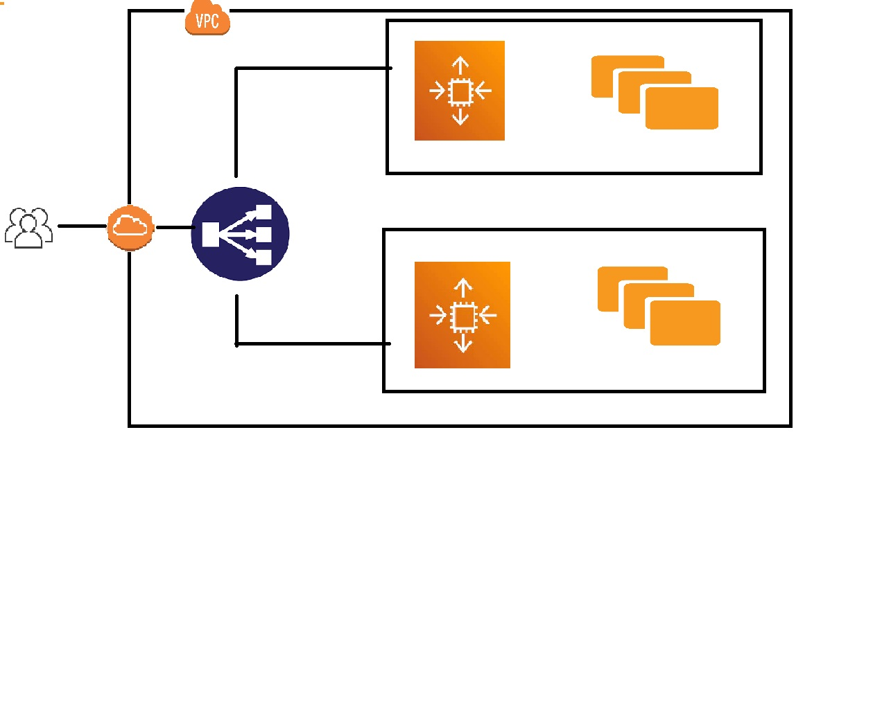

# Green Blue Deployment

- Created Security Group
- Created Launch Configuration for AutoScaling Group
- Created Elastic Load Balancer
- Created AutoScaling Group
- Connected AutoScaling Group with Elastic Load Balancer

# Configuration Block

Data Block
  defined a data source called aws_ami which retrieves the most recent Ubuntu AMI that matches the specified filters.

Resource block 
   It creates an EC2 instance using the Ubuntu AMI obtained from the data source. It specifies the instance type, key pair name for SSH access, security group, and assigns tags to the instance.

Resource block 
   It creates aws_security_group named second_security. It defines a security group that allows incoming traffic on port 80 (HTTP) and port 22 (SSH), and outgoing traffic to all ports. Tags are also assigned to this security group.

Resource block
  It creates aws_autoscaling_group named asg_1. It sets up an auto-scaling group with a minimum size of 2 instances and a maximum size of 4 instances. It specifies the availability zones, load balancers, and launch configuration associated with this auto-scaling group.

Resource block
  It creates aws_elb resource named raj_terra for an Elastic Load Balancer (ELB). It configures the ELB with listener settings for HTTP traffic on port 80. It also sets up health checks to monitor the instances behind the ELB. The ELB is associated with the aws_instance resource instance_1.

Finally, there is a resource block for aws_launch_configuration named launch_conf. It specifies the launch configuration for the auto-scaling group, including the AMI, instance type, key pair, security group, and user data script. The user data script is encoded using the filebase64 function.

These resource blocks describe the desired state of the AWS infrastructure, and Terraform can use this configuration to create and manage the resources accordingly. By running terraform apply with this configuration, Terraform will provision the specified resources on AWS based on the defined settings.